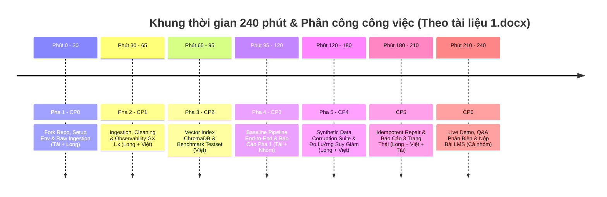

# HƯỚNG DẪN TỪNG BƯỚC HOÀN THIỆN DỰ ÁN (PROJECT GUIDE - TEAM 3 NGUỜI)
## Day 10 — Data Pipeline & Data Observability for RAG

> **Dự án:** Data Pipeline & Data Observability cho Hệ Thống RAG Agent  
> **Lớp:** K4-L3-DAY10  
> **Tên Repository Nộp Bài:** `K4A-DAY10-Team3-DataPipeline` (hoặc `K4-L3-DAY10-Team3-DataPipeline`)  
> **Thời lượng thực hiện:** 240 phút (4 giờ)  
> **Cấu trúc tài liệu bổ sung:** Cập nhật đồng bộ theo file chỉ dẫn thực hành mới nhất (`1.docx`).

---

## 1. THÔNG TIN NHÓM & PHÂN CÔNG VAI TRÒ (3 THÀNH VIÊN)

| STT | Họ và tên | MSSV | Vai trò chính trong dự án | File Báo cáo cá nhân |
|:---:|:---|:---:|:---|:---|
| **1** | **Nguyễn Như Tài** *(Trưởng Nhóm)* | **2A202602976** | **Pipeline Lead & Infrastructure Architect**<br>• Thiết lập môi trường, cấu hình `core/`<br>• Lập trình 2 pipeline chính (`phase1.py`, `corruption_flow.py`) và 2 entrypoint script (`run_phase1.py`, `run_corruption_flow.py`) <br>• Quản lý Git repository, code review, kiểm tra Contributor tracking & LMS submission | `report/2A202602976_NguyenNhuTai.md` |
| **2** | **Lò Văn Long** | **2A202602541** | **Data Engineer (Ingestion, Cleaning, Corruption & Repair)**<br>• Thu thập dữ liệu API Crossref + fallback local snapshot (`crossref.py`)<br>• Làm sạch dữ liệu, chuẩn hóa text, tính `age_days` (`cleaning.py`)<br>• Giả lập 6 kịch bản tiêm lỗi dữ liệu (`corruption.py`)<br>• Thực thi cơ chế tự phục hồi dữ liệu an toàn (Idempotent Repair) | `report/2A202602541_LoVanLong.md` |
| **3** | **Hoàng Quốc Việt** | **2A202602563** | **AI & MLOps Specialist (Retrieval, Observability & Evaluation)**<br>• Quản lý embedding MiniLM và ChromaDB Vector Database (`index.py`, `embeddings.py`)<br>• Thiết lập Data Quality Gate theo chuẩn **Great Expectations 1.x** & Freshness SLA (`quality.py`)<br>• Xây dựng bộ đề thi Benchmark 5-10 câu (`testset.py`) & đo lường chỉ số Hit Rate/Token F1 (`metrics.py`)<br>• Xuất các báo cáo Markdown định lượng 3 trạng thái (`reporting.py`) | `report/2A202602563_HoangQuocViet.md` |

---

## 2. PHÂN CHIA NHIỆM VỤ: PHÂN NĂNG NHÓM VS CÁ NHÂN

### 🤝 A. Nhiệm vụ Chung Của Cả Nhóm (Group Tasks)
1. **Họp Kickoff & Thảo luận Kiến trúc (CP0 - Phút 0 – 30):**
   - Đổi tên Repo fork về: `K4A-DAY10-Team3-DataPipeline`.
   - Add đầy đủ 3 thành viên làm Collaborators trong GitHub Settings.
   - Phân công rõ ràng 3 vai trò chính.
2. **Kiểm thử Tích hợp End-to-End (CP3 & CP5):**
   - Cùng nhau chạy thử nghiệm `python script/run_phase1.py` để verify Baseline.
   - Cùng nhau chạy `python script/run_corruption_flow.py` để kiểm chứng hiện tượng **Silent Failure** và khả năng **Self-healing**.
3. **Bảo vệ Live Demo Trước Lớp (CP6 - Phút 210 – 240):**
   - Trình diễn bảng đối chiếu 3 trạng thái (Baseline vs Corrupted vs Repaired) từ file `corruption_report.md`.
   - Trả lời các câu hỏi phản biện của Giảng viên & Trợ giảng (về Great Expectations 1.x API ephemeral, Freshness SLA, vector embeddings, tính Idempotent).
4. **Nộp Bài Độc Lập Trên LMS (Bắt buộc 100%):**
   - Dù làm chung repo, **mỗi cá nhân bắt buộc dùng tài khoản LMS của mình** nộp link GitHub repository trước 23:59:59.

---

### 👤 B. Nhiệm vụ Chi Tiết Của Từng Cá Nhân (Individual Tasks)

#### 🔵 1. Nguyễn Như Tài (Trưởng Nhóm - 2A202602976)
- [ ] **Task 1.1:** Khởi tạo Git repo nhóm (`K4A-DAY10-Team3-DataPipeline`), mời **Lò Văn Long** và **Hoàng Quốc Việt** vào Collaborators.
- [ ] **Task 1.2:** Thiết lập môi trường ảo `.venv`, cài đặt packages qua `python -m pip install -e .` (chế độ editable).
- [ ] **Task 1.3:** Rà soát và hoàn thiện module cấu hình `src/core/config.py`, `src/core/paths.py`, `src/core/models.py`.
- [ ] **Task 1.4:** Lập trình pipeline điều phối Pha 1 (`src/pipelines/phase1.py`) & script thực thi (`script/run_phase1.py`).
- [ ] **Task 1.5:** Lập trình pipeline điều phối Pha 2 (`src/pipelines/corruption_flow.py`) & script thực thi (`script/run_corruption_flow.py`).
- [ ] **Task 1.6:** Quản lý và kiểm tra biểu đồ **Insights > Contributors** trên GitHub nhánh `main` để đảm bảo cả 3 thành viên đều có commit ghi nhận.
- [ ] **Task 1.7:** Điền file phân công `docs/TEAM.md` và hoàn thiện báo cáo cá nhân `report/2A202602976_NguyenNhuTai.md`.

#### 🟢 2. Lò Văn Long (Data Engineer - 2A202602541)
- [ ] **Task 2.1:** Hoàn thiện module `src/ingestion/crossref.py`:
  - Lập trình `parse_crossref_payload()` để bóc tách: `paper_id` (DOI chuẩn hóa), `title`, `summary` (xóa các thẻ XML/HTML rác như `<jats:p>`), `authors`, `categories`, `published` (parse ISO 8601).
  - Lập trình `fetch_source_records()` gửi request đến Crossref API, tự động ghi fallback ra snapshot `data/raw/crossref_response.json` khi dính 429 hoặc mất mạng (Dual-Mode).
  - Lập trình `load_raw_records()` để đọc file thô cất giữ bản gốc (Raw Preservation).
- [ ] **Task 2.2:** Hoàn thiện module `src/ingestion/cleaning.py`:
  - Lập trình `build_clean_dataframe()`: xóa thẻ HTML rác, chuẩn hóa khoảng trắng.
  - Tính trường `age_days = (run_date - published).days`.
  - Khử trùng lặp theo `paper_id`.
  - Sinh đoạn ngữ cảnh chuẩn hóa `text_for_embedding` gồm 5 phần: `Title`, `Authors`, `Published`, `Categories`, `Summary`.
- [ ] **Task 2.3:** Hoàn thiện module `src/ingestion/corruption.py`:
  - Triển khai 6 kịch bản tiêm lỗi dữ liệu thực tế:
    1. Drop latest records (bỏ bài mới nhất).
    2. Blank summary (xóa rỗng summary).
    3. Inject text noise (chèn rác vào `text_for_embedding`).
    4. Truncate title (cắt ngắn tiêu đề < 10 ký tự).
    5. Stale date (đổi ngày xuất bản về 5 năm trước).
    6. Duplicate rows (nhân bản dòng).
  - Ghi nhật ký vết lỗi ra `data/results/corruption_log.json`.
- [ ] **Task 2.4:** Thực thi cơ chế **Idempotent Repair**: Đảm bảo luồng khôi phục dữ liệu từ `data/raw/crossref_records.json` hoạt động mượt mà, chạy lại N lần vẫn cho kết quả sạch trùng khớp 100%.
- [ ] **Task 2.5:** Viết báo cáo cá nhân `report/2A202602541_LoVanLong.md`.

#### 🟣 3. Hoàng Quốc Việt (AI & MLOps Specialist - 2A202602563)
- [ ] **Task 3.1:** Hoàn thiện module `src/observability/quality.py` (**Data Quality Gate với Great Expectations 1.x**):
  - Khởi tạo context dạng Ephemeral (chuẩn API GX 1.x mới):
    ```python
    context = gx.get_context(mode="ephemeral")
    data_source = context.data_sources.add_pandas(name="papers_source")
    data_asset = data_source.add_dataframe_asset(name="papers_asset")
    batch_def = data_asset.add_batch_definition_whole_dataframe("papers_batch")
    batch = batch_def.get_batch(batch_parameters={"dataframe": df})
    ```
  - Định nghĩa 4 Expectations thiết yếu: `ExpectTableRowCountToBeBetween` (5-5000), `ExpectColumnValuesToNotBeNull` (`paper_id`, `title`, `text_for_embedding`), `ExpectColumnValuesToBeUnique` (`paper_id`), `ExpectColumnValueLengthsToBeBetween` (`summary` >= 30 ký tự).
  - Tính toán Freshness SLA: Cảnh báo dữ liệu bị mốc nếu tỉ lệ bài có `age_days > 180` vượt quá 25%.
- [ ] **Task 3.2:** Hoàn thiện module `src/retrieval/index.py` & `embeddings.py`:
  - Khởi tạo mô hình nhúng `sentence-transformers/all-MiniLM-L6-v2`.
  - Nạp dữ liệu vào ChromaDB Vector Store với các collection riêng biệt (`papers-baseline`, `papers-corrupted`, `papers-repaired`).
- [ ] **Task 3.3:** Hoàn thiện module `src/evaluation/testset.py` & `metrics.py`:
  - Lập trình `load_or_create_test_set()` sinh bộ đề thi phủ 5 dạng câu hỏi: `summary`, `authors`, `date`, `category`, `multi_hop` (câu hỏi liên ngành).
  - Mỗi mẫu có cấu trúc: `id`, `type`, `question`, `ground_truth`, `ground_truth_doc_ids`.
  - Đo lường chỉ số `Hit Rate` (truy xuất đúng tài liệu) và `Token F1` (độ chính xác câu trả lời).
- [ ] **Task 3.4:** Hoàn thiện module `src/observability/reporting.py`:
  - Xuất file báo cáo `data/reports/phase1_report.md` và `data/reports/corruption_report.md` chứa bảng đối chiếu 3 trạng thái.
- [ ] **Task 3.5:** Viết báo cáo cá nhân `report/2A202602563_HoangQuocViet.md`.

---

## 3. LỘ TRÌNH THỰC THI CHI TIẾT THEO PHASING VÀ CHECKPOINTS (240 PHÚT)



---

### ⏱️ PHA 1: THIẾT LẬP MÔI TRƯỜNG & KICKOFF (CHECKPOINT 0: PHÚT 0 – 30)
- **Mục tiêu:** Chuẩn bị môi trường Python 3.11+, fork repo nhóm, cài đặt dependencies và kiểm tra kết nối.
- **Thao tác thực hiện:**
  1. **Nguyễn Như Tài (Leader):**
     - Fork starter repo: `https://github.com/VinUni-AI20k/K4-L3A-Day10-Data-Pipeline-Data-Observability`.
     - Đặt tên repo nhóm: `K4A-DAY10-Team3-DataPipeline`.
     - Vào **Settings > Collaborators > Add people** để mời **Lò Văn Long** và **Hoàng Quốc Việt**.
  2. **Từng thành viên:**
     - Clone repo nhóm về máy:
       ```bash
       git clone https://github.com/<UserTruongNhom>/K4A-DAY10-Team3-DataPipeline.git
       cd K4A-DAY10-Team3-DataPipeline
       ```
     - Kích hoạt môi trường và cài đặt dependencies (chế độ editable package):
       ```powershell
       python -m venv .venv
       .\.venv\Scripts\Activate.ps1
       python -m pip install --upgrade pip
       python -m pip install -e .
       ```
     - Tạo file `.env` từ `.env.example`:
       ```powershell
       Copy-Item .env.example .env
       ```
     - Chạy lệnh kiểm tra kết nối thư viện cốt lõi:
       ```bash
       python -c "import chromadb, great_expectations, sentence_transformers; print('Môi trường sẵn sàng')"
       ```
- **Tín hiệu hoàn thành:** Console in ra `Môi trường sẵn sàng`.

---

### ⏱️ PHA 2: THU THẬP DỮ LIỆU, LÀM SẠCH & DỰNG TRẠM KIỂM SOÁT QUALITY (CHECKPOINT 1: PHÚT 30 – 65)
- **Mục tiêu:** Lấy dữ liệu thô, làm sạch, tính `age_days` và dựng Quality Gate GX 1.x + Freshness SLA.
- **Thao tác thực hiện:**
  1. **Lò Văn Long:**
     - Hoàn thiện `src/ingestion/crossref.py` (parse DOI, title, summary xóa XML tag, ISO 8601 dates).
     - Kiểm tra Ingestion Bước 1:
       ```bash
       python -c "from core.config import load_settings; from ingestion.crossref import fetch_source_records; s=load_settings(); r=fetch_source_records(s); print(f'Tín hiệu hoàn thành: Đã nạp {len(r)} bài báo')"
       ```
     - Hoàn thiện `src/ingestion/cleaning.py` (tính `age_days`, ghép `text_for_embedding`, khử trùng lặp `paper_id`).
     - Kiểm tra Cleaning Bước 2:
       ```bash
       python -c "from datetime import datetime, timezone; from core.config import load_settings; from ingestion.crossref import load_raw_records; from ingestion.cleaning import build_clean_dataframe; s=load_settings(); df=build_clean_dataframe(load_raw_records(s.paths.raw_records_json), datetime.now(timezone.utc)); print(f'Tín hiệu hoàn thành: Clean thành công {len(df)} dòng')"
       ```
  2. **Hoàng Quốc Việt:**
     - Hoàn thiện `src/observability/quality.py` (GX 1.x Ephemeral mode, 4 Expectations & Freshness Check `age_days > 180`).
     - Kiểm tra Quality Check Bước 3:
       ```bash
       python -c "from core.config import load_settings; from observability.quality import run_data_quality_checks; import pandas as pd; s=load_settings(); df=pd.read_json(s.paths.clean_json); res=run_data_quality_checks(df, s, 'test'); print(f'Tín hiệu hoàn thành: Quality check status = {res[\"success\"]}')"
       ```
- **Tín hiệu hoàn thành:** Console lần lượt in:
  - `Tín hiệu hoàn thành: Đã nạp 24 bài báo`
  - `Tín hiệu hoàn thành: Clean thành công 24 dòng`
  - `Tín hiệu hoàn thành: Quality check status = True`

---

### ⏱️ PHA 3: VECTOR INDEX CHROMADB & TẠO BENCHMARK TEST SET (CHECKPOINT 2: PHÚT 65 – 95)
- **Mục tiêu:** Nạp dữ liệu sạch vào Vector Store ChromaDB và tạo bộ câu hỏi benchmark 5-10 câu.
- **Thao tác thực hiện:**
  1. **Hoàng Quốc Việt:**
     - Hoàn thiện `src/evaluation/testset.py` xây dựng 5 dạng câu hỏi (`summary`, `authors`, `date`, `category`, `multi_hop`).
     - Kiểm tra Benchmark Test Set Bước 1:
       ```bash
       python -c "from core.config import load_settings; from evaluation.testset import load_or_create_test_set; import pandas as pd; s=load_settings(); df=pd.read_json(s.paths.clean_json); ts=load_or_create_test_set(df, s.paths.test_set_json); print(f'Tín hiệu hoàn thành: Test set gồm {len(ts.samples)} câu hỏi')"
       ```
     - Smoke test Vector Retrieval & QA Agent Bước 2:
       ```bash
       python -c "from core.config import load_settings; from retrieval.index import LocalEmbeddingIndex; s=load_settings(); idx=LocalEmbeddingIndex(s, collection_name='papers-baseline'); idx.build_from_clean(); res=idx.semantic_search('machine learning', top_k=2); print(f'Tín hiệu hoàn thành: Tìm thấy {len(res)} tài liệu liên quan')"
       ```
- **Tín hiệu hoàn thành:** Console in `Test set gồm 5 câu hỏi` và `Tìm thấy 2 tài liệu liên quan`.

---

### ⏱️ PHA 4: BASELINE PIPELINE END-TO-END & BÁO CÁO PHA 1 (CHECKPOINT 3: PHÚT 95 – 120)
- **Mục tiêu:** Chạy end-to-end chu trình dữ liệu sạch để thiết lập chỉ số chuẩn ban đầu (Baseline Benchmarks).
- **Thao tác thực hiện:**
  1. **Nguyễn Như Tài:**
     - Chạy toàn bộ luồng Phase 1 bằng script:
       ```bash
       python script/run_phase1.py
       ```
  2. **Cả Nhóm Kiểm Tra Artifacts Được Sinh Ra:**
     - `data/clean/papers_clean.csv`: Bảng dữ liệu sạch hoàn chỉnh.
     - `data/chroma/`: Vector database đã được nạp dữ liệu.
     - `data/eval/test_set.json`: Bộ câu hỏi benchmark cố định.
     - `data/results/baseline_metrics.json`: Bảng chỉ số Baseline (Retrieval Hit Rate, Token F1, LLM Judge Score).
     - `data/reports/phase1_report.md`: Báo cáo chi tiết định dạng Markdown.
- **Tín hiệu hoàn thành:** Script chạy không báo lỗi, sinh đầy đủ 5 file artifacts trên.

---

### ⏱️ PHA 5: THỬ THÁCH TIÊM ĐỘC TỐ DỮ LIỆU & ĐO LƯỜNG SUY GIẢM (CHECKPOINT 4: PHÚT 120 – 180)
- **Mục tiêu:** Chứng minh hiện tượng Silent Failure khi tiêm 6 kịch bản lỗi vào dữ liệu.
- **Thao tác thực hiện:**
  1. **Lò Văn Long:**
     - Hoàn thiện `corrupt_clean_dataframe()` trong `src/ingestion/corruption.py` (Drop latest, Blank summary, Inject text noise, Truncate title < 10 ký tự, Stale date 5 năm trước, Duplicate rows).
     - Kiểm tra nhanh hàm tiêm lỗi:
       ```bash
       python -c "from core.config import load_settings; from ingestion.corruption import corrupt_clean_dataframe; import pandas as pd; s=load_settings(); df=pd.read_json(s.paths.clean_json); c=corrupt_clean_dataframe(df, s.paths.corruption_log); print(f'Tín hiệu hoàn thành: Corrupted {len(c)} dòng')"
       ```
  2. **Hoàng Quốc Việt:** Đánh giá lại RAG Agent trên dữ liệu bị tiêm lỗi và ghi chỉ số sụt giảm ra `data/results/corrupted_metrics.json`.
- **Tín hiệu hoàn thành:** Console in `Corrupted 24 dòng`, file `data/results/corruption_log.json` được tạo ghi nhận đủ 6 kịch bản lỗi.

---

### ⏱️ PHA 6: PHỤC HỒI AN TOÀN & ĐỐI CHIẾU 3 TRẠNG THÁI (CHECKPOINT 5: PHÚT 180 – 210)
- **Mục tiêu:** Tự động kích hoạt cơ chế Idempotent Repair khôi phục từ bản thô `crossref_records.json` và xuất báo cáo đối chiếu 3 trạng thái.
- **Thao tác thực hiện:**
  1. **Lò Văn Long & Việt:** Phục hồi dữ liệu và xuất `repaired_metrics.json`.
  2. **Nguyễn Như Tài:** Lập trình `src/pipelines/corruption_flow.py` & chạy thử nghiệm end-to-end Pha 2:
     ```bash
     python script/run_corruption_flow.py
     ```
- **Tín hiệu hoàn thành:** Console in ra bảng so sánh 3 cột (**Baseline vs Corrupted vs Repaired**). File `data/reports/corruption_report.md` được sinh hoàn chỉnh.

---

### ⏱️ PHA 7: LIVE DEMO, Q&A PHẢN BIỆN & NỘP BÀI LMS (CHECKPOINT 6: PHÚT 210 – 240)
- **Mục tiêu:** Trình diễn trực tiếp trước lớp, trả lời câu hỏi phản biện và hoàn tất nộp bài.
- **Thao tác thực hiện:**
  1. **Cả Nhóm:** Chuẩn bị terminal sẵn sàng chạy demo `run_phase1.py` và `run_corruption_flow.py`.
  2. **Trình diễn Live Demo (3-5 phút):**
     - Mở file `data/reports/corruption_report.md` chỉ ra bảng 3 cột số liệu.
     - Phân tích hiện tượng Silent Failure khi RAG bị tiêm lỗi và vai trò của Great Expectations Quality Gate.
     - Trả lời các câu hỏi kỹ thuật từ Giảng viên/Trợ giảng.
  3. **Nguyễn Như Tài (Leader):**
     - Mở GitHub Repo > **Insights > Contributors** kiểm tra cả 3 thành viên đều xuất hiện biểu đồ commit trên nhánh `main`.
     - Nhắc nhở **Lò Văn Long** và **Hoàng Quốc Việt** tự tay nộp đường link repository lên VLearn LMS trước 23:59:59.

---

## 4. MA TRẬN BẰNG CHỨNG NGHIỆM THU (CHECKLIST TIÊU CHÍ 100 ĐIỂM)

| STT | Hạng mục kiểm tra | Trọng số | Thành viên phụ trách | File bằng chứng (Artifact) |
|:---:|:---|:---:|:---:|:---|
| 1 | Cấu trúc module & môi trường | 10đ | Nguyễn Như Tài | `pyproject.toml`, `.env`, Console in `Môi trường sẵn sàng` |
| 2 | Raw Ingestion & Data Lineage | 15đ | Lò Văn Long | `crossref.py`, `data/raw/crossref_response.json`, `data/raw/crossref_records.json` |
| 3 | Data Cleaning & Text Modeling | 15đ | Lò Văn Long | `cleaning.py`, `data/clean/papers_clean.csv`, `text_for_embedding` |
| 4 | Vector Indexing & ChromaDB | 10đ | Hoàng Quốc Việt | `index.py`, `embeddings.py`, thư mục persisted ChromaDB |
| 5 | Multi-Provider RAG Agent | 10đ | Hoàng Quốc Việt | `agent.py`, `llm.py`, `qa.py` |
| 6 | Baseline Benchmark Scoring | 10đ | Hoàng Quốc Việt | `testset.py`, `data/results/baseline_metrics.json`, `phase1_report.md` |
| 7 | GX 1.x Quality Gate & SLA | 15đ | Hoàng Quốc Việt | `quality.py`, log validation Great Expectations 1.x, Freshness SLA |
| 8 | Corruption Suite & Repair Report | 15đ | Lò Văn Long & Việt | `corruption.py`, `corruption_log.json`, `corruption_report.md` (3 cột) |
| **TỔNG** | **BÀI BẮT BUỘC** | **100đ** | **CẢ NHÓM** | **100% Pass All Checkpoints** |

---

## 5. BÁO CÁO CÁ NHÂN CẦN HOÀN THIỆN TRONG THƯ MỤC `report/`

Mỗi thành viên cập nhật báo cáo cá nhân của mình đúng đường dẫn quy định:
- Nguyễn Như Tài: [`report/2A202602976_NguyenNhuTai.md`](file:///d:/vinuni%20AI/lab10/K4-L3A-Day10-Data-Pipeline-Data-Observability/report/2A202602976_NguyenNhuTai.md)
- Lò Văn Long: [`report/2A202602541_LoVanLong.md`](file:///d:/vinuni%20AI/lab10/K4-L3A-Day10-Data-Pipeline-Data-Observability/report/2A202602541_LoVanLong.md)
- Hoàng Quốc Việt: [`report/2A202602563_HoangQuocViet.md`](file:///d:/vinuni%20AI/lab10/K4-L3A-Day10-Data-Pipeline-Data-Observability/report/2A202602563_HoangQuocViet.md)

---

> 💡 **LỜI KHUYÊN CHO TRƯỞNG NHÓM NGUYỄN NHƯ TÀI:**  
> Đảm bảo cả 3 thành viên đều chạy lại các lệnh kiểm tra (smoke tests) từng bước như hướng dẫn ở trên trước khi tiến hành push code. Điều này giúp đảm bảo 100% không phát sinh lỗi `ModuleNotFoundError` hay lỗi xung đột cú pháp Great Expectations 1.x. Chúc nhóm bảo vệ thành công rực rỡ! 🚀
